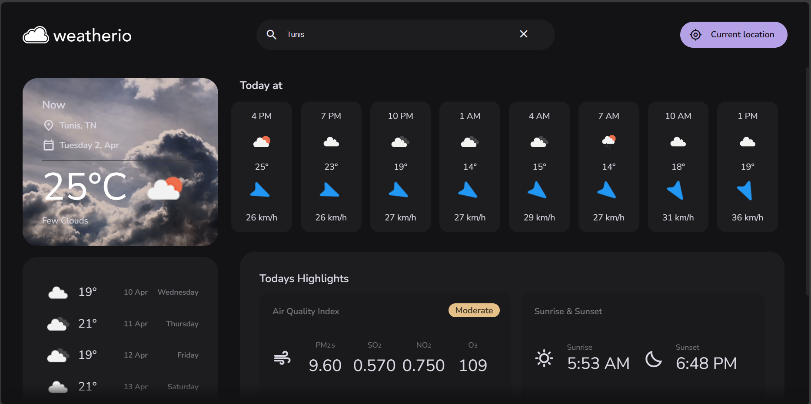

# Weatherio

## Overview

This web interface presents a comprehensive and user-friendly view offers an at-a-glance view of current and forecasted conditions, powered by OpenWeatherMap API. It features the current temperature, sky state, and a 5-day weather outlook, including hourly predictions for temperature, rain, and wind speeds. The interface also highlights air quality indices and daily sunrise and sunset times. With a simple search, users can access weather details for any location or use their current whereabouts for real-time updates, all within a sleek, user-centric design.

